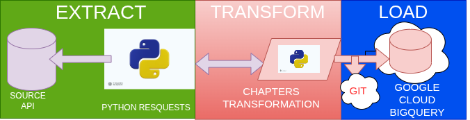

# DU University Chapters ETL Pipeline  
### A Google Cloud Based Data Engineering Project
---
## Project Overview

This project implements a modular and scalable **ETL (Extract, Transform, Load) pipeline** built with **Python** and integrated with **Google Cloud Platform (GCP)** services.

It follows modern Data Engineering best practices including:

- Modular ETL architecture
- Structured logging
- Environment-based configuration
- Unit & integration testing
- Secure service account authentication
- BigQuery-ready loading layer
- Clean and maintainable project structure

---
#  ETL Architecture



---

## Architecture Flow

### Extract
- Pull data from Ducks Unlimited University Chapters API System
- Implemented in: `app/extractor.py`

### Transform
- Clean, validate, and standardize data
- Implemented in: `app/main.py`

### Load
- Load processed data into BigQuery
- Implemented in: `app/loader.py`

### Logging
- Centralized structured logging configuration
- Implemented in: `app/logging_config.py`

---

#  Project Structure
```
du-university-chapters-etl/
│
├── app/                  # Core application (ETL logic)
├── image/                # Architecture diagrams / documentation assets
├── tests/                # Unit & integration tests
├── requirements.txt      # Project dependencies
└── readme.md             # Project documentation
```
#  Local Development Setup
## Clone Repository
- git clone https://github.com/ifistic/du-university-chapters-etl
- cd du-university-chapters-etl

### create virtual environmet
- python3 -m venv .venv_uni
- source .venv_uni/bin/activate  # Mac/Linux
# Create Virtual Environment
- python3 -m venv .venv_uni
- source .venv_uni/bin/activate  # Mac/Linux
-- Windows activation
- .venv_uni\Scripts\activate

# Install Dependencies
- pip install --upgrade pip
- pip install -r requirements.txt

## Google Cloud Authentication
Before running the project, authenticate with Google Cloud.
Step 1: Enable Required APIs
- Go to: https://console.cloud.google.com
- Navigate to: APIs & Services → Library
- Enable: BigQuery API

## Cloud Logging API

Step 2: Create a Service Account

- Go to IAM role: Service Accounts
- Create a new service account
  -- Assign the following roles:
  -- BigQuery Admin or BigQuery Data Editor as Logs Writer

Step 3: Download JSON Key
- Download the service account key and store it securely.

Step 4: Configure Environment Variables
-
- Create a .env file in the project root:
- GOOGLE_APPLICATION_CREDENTIALS=/path/to/service-account.json
- PROJECT_ID=your_project_id
- BQ_DATASET=du_data
- BQ_TABLE=raw_university

### Never commit .env or JSON credentials to version control.

# Testing
- Run tests from the root directory.

# Unit Tests
- pytest tests/unit
-- Unit tests validate individual components such as the extractor logic.

# Running the ETL Pipeline
From the project root:
- python -m app.main
-- This command will:
- Extract raw data
- Transform and clean data

# Load processed data into BigQuery

- view log execution status

### Logging is configured in: app/logging_config.py

# Technologies Used

- Python 3.12

- Pandas and requests

- Pytest

- Google Cloud Platform

- BigQuery

- python-dotenv

# Best Practices

- Use environment variables for secrets

- Never commit credentials

- Assign least-privilege IAM roles

- Separate configuration from logic

- Structured logging enabled

- Tests validate data integrity

# Future Enhancements

- GitHub Actions CI/CD

- GCS staging layer

- Data validation with Great Expectations

- Airflow orchestration

- Monitoring dashboards

- Infrastructure as Code (Terraform)
